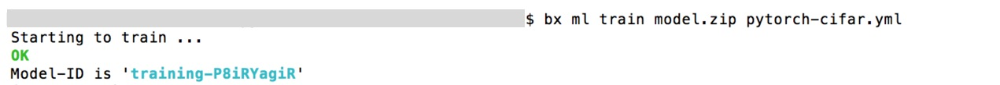
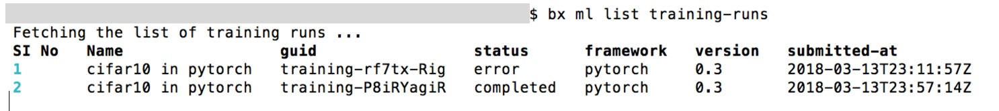
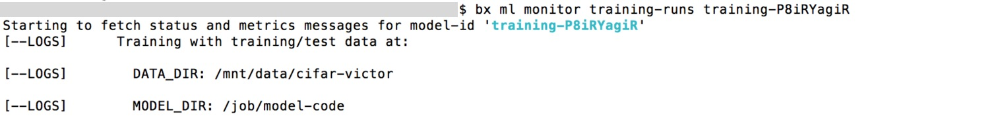
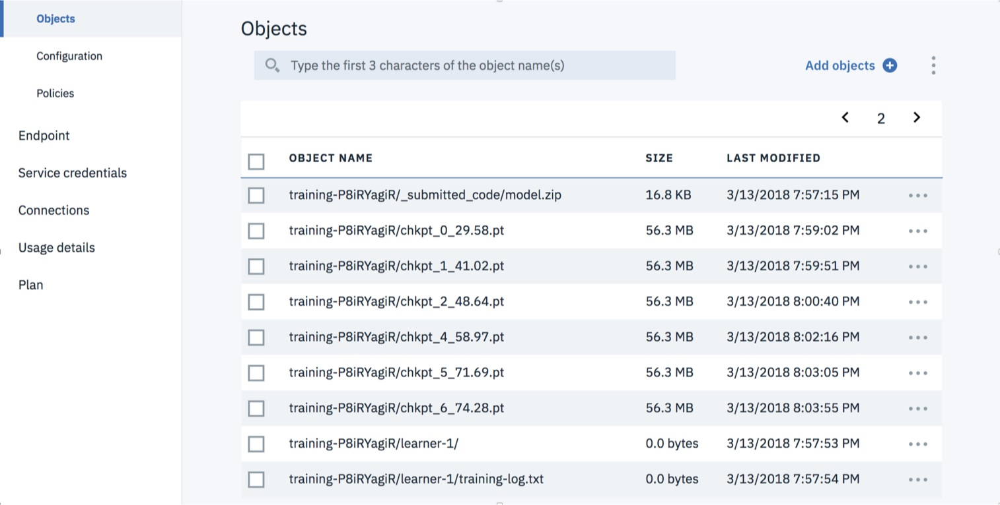

## Tutorial
Now, to test that your setup is working, lets try a simple model.

Step 0: Get a dataset
Step 1: Upload your dataset to the bucket
Step 2: Edit your manifest file
Step 3: Send code to run on Watson Studio!
Step 4: Monitor the training

### Step 0. Get a dataset 
For example, lets get the cifar10 dataset and do a little trainning.
You can get this dataset from the Internet, e.g., by doing:
```
mkdir cifar10
cd cifar10
wget https://www.cs.toronto.edu/~kriz/cifar-10-python.tar.gz
tar xvf cifar-10-python.tar.gz
rm cifar-10-python.tar.gz
```
or

Download all the data from this [link](https://ibm.box.com/s/5ss0adenqf4dow9bqynb687cuu1oh79q)


### Step 1: Upload the dataset to your bucket:
We assign the name of the bucket to a shell variable
```
$ bucket_name=<your_bucket_name>
$ bxaws s3 cp cifar10/  s3://$bucket_name/cifar10 --recursive
```
(optional) Verify that the data was successfully uploaded using this comand.

```
$ bxaws  s3 ls s3://$bucket_name/cifar10
```


### Step 2: Edit your manifest file, e.g., `pytorch-cifar.yml`

This yaml file should hold all the information needed for executing the job, including what bucket, ml framework, and computing instance to use.


#### 2.1. Copy the template manifest:

Make a copy from 
Download the [template](https://github.com/mypublicorg/pytorch-cifar10-in-ibm-cloud/blob/master/pytorch-cifar-template.yml)
and then make a copy of it to be edited.

```
$ cp pytorch-cifar-template.yml my-pytorch-cifar.yml
```
#### 2.2. Edit the configuration file:

Edit `my-pytorch-cifar.yml`:
Add your author info and replace the values of `aws_access_key_id`, `aws_secret_access_key`, and `bucket` 
with your storage instance credentials and bucket name.
This should be done for both the data input reference (`training_data_reference`) 
and the output reference (`training_results_reference`). 
Notice that you may use the same bucket for both input and output, but this is not required.

```yaml
model_definition:
  framework:
#framework name and version (supported list of frameworks available at 'bx ml list frameworks')
    name: pytorch
    version: 0.4
#name of the training-run
  name: MYRUN
#Author name and email
  author:
    name: JOHN DOE
    email: JOHNDOE@MIT.EDU
  description: This is running cifar training on multiple models
  execution:
#Command to execute -- see script parameters in later section !!
    command: python3 main.py --cifar_path ${DATA_DIR}/cifar10
      --checkpoint_path ${RESULT_DIR} --epochs 10
    compute_configuration:
#Valid values for name - k80/k80x2/k80x4/p100/p100x2/v100/v100x2
      name: k80
training_data_reference:
  name: training_data_reference_name
  connection:
    endpoint_url: "https://s3-api.us-geo.objectstorage.service.networklayer.com"
    aws_access_key_id: < YOUR SAVED ACCESS KEY >
    aws_secret_access_key: < YOUR SAVED SECRET ACCESS KEY >
  source:
    bucket: < mybucketname >
  type: s3
training_results_reference:
  name: training_results_reference_name
  connection:
    endpoint_url: "https://s3-api.us-geo.objectstorage.service.networklayer.com"
    aws_access_key_id: < YOUR SAVED ACCESS KEY >
    aws_secret_access_key: < YOUR SAVED SECRET ACCESS KEY >
  target:
    bucket: < mybucketname >
  type: s3
```

Notice that under `execution` in the yaml file, we specified a command that will be executed 
when the job starts execution at the server. (make sure you give right path to data)

```
python3 main.py --cifar_path ${DATA_DIR}/cifar10
      --checkpoint_path ${RESULT_DIR} --epochs 5
```

This command will execute `main.py`, which starts a training run.  
Since no model is specified, it will use the default model, `vgg16`, 
for 5 epochs using the dataset that we uploaded to the bucket. 

### Step 3: Send code to run on Watson Studio!

#### 3.1. Zip all the code and models into a .zip file:
```
$ zip model.zip main.py models/*
```

#### 3.2. Send your code and manifest to IBM Watson Studio:
```
$ bx ml train model.zip pytorch-cifar.yml
```



That's it! The command should generate a training ID for you, meaning our model has started training on Watson!

### Step 4: Monitor the training

#### We can check the status of all training using the command:
```
$ bx ml list training-runs
```


#### Continuously monitor a training run by using the `bx ml monitor` command:
```
$ bx ml monitor training-runs < trainingID >
```


As training proceeds, you should see results from the training process being copied to the results bucket specified 
in `training_results_references.target bucket`.



You can also inspect the status of training by downloading and viewing the training log file which has been copied to the results bucket. (This can be useful for debugging).

#### To do this, run:
```
$ bxaws s3 cp s3://my_bucket/ < trainingID>/learner-1/training-log.txt -
```

### Additional Information on Deep Learning in IBM Cloud

- [Deep Learning in IBM Studio](https://www.ibm.com/cloud/deep-learning)
- [Deep Learning Documentation](https://dataplatform.ibm.com/docs/content/analyze-data/ml_dlaas_working_with_new_models.html)


## Enjoy
Content derived from material provided by Kaouta el Maghraoui (IBM Research), German Goldszmidt (IBM WCP),
Hendryk Strobelt (IBM Research).

