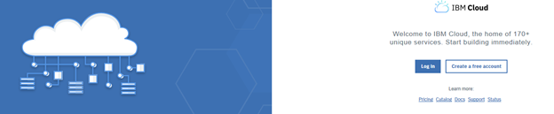
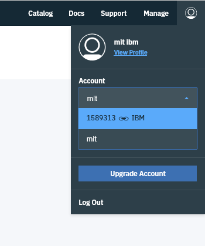
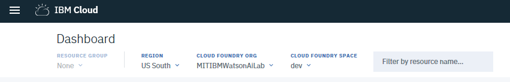
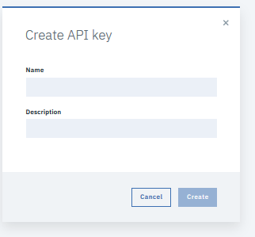
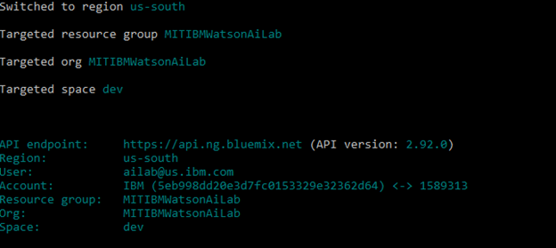
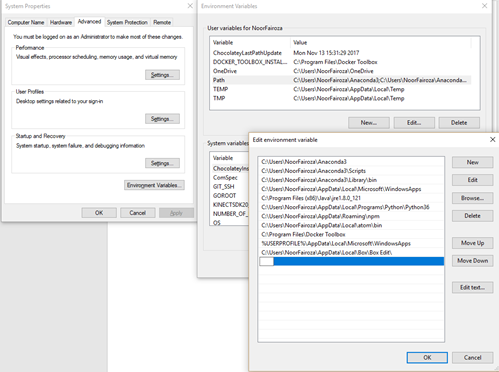

# Pre-Requisites for the IBM Watson studio Dlaas Tutorial
 
### Please make sure you satisfy the following list of pre- requisites before you attend DlaaS Tutorial.
#### Checklist:
1. Access to internal IBM Cloud Account

2. Python dependency

3. Install the IBM Cloud developer tools

4. Access your IBM Cloud account using cli.

                       4.1. Get your API Key
                       
                       4.2  Login using API Key
                       
5. Target correct Org, Space and Endpoint for the tutorial.

6. Troubleshooting.


 
### 1. Access to the internal IBM Cloud account
please verify that you have access to Internal IBM cloud account.

Login to [https://console.bluemix.net/](https://console.bluemix.net/) 



Click on the profile avatar in the top-right-corner for the webpage.

Under the account, you should see a dropdown box, with a list of all the IBM cloud accounts you have access to.

Select the AI Lab account by choosing 1589313—IBM account. 



 
(Notice that sometimes the account is just listed as ‘IBM’.)

Verify the account access by checking that the CLOUD FOUNDRY ORG is ‘MITIBMWatsonAiLab’



If you do not have MITIBMAiLab under Cloud Foundry Org, stop here and contact Noor Fairoza via slack or email.

### 2. Python
If either python or pip are not installed, Goto [https://www.python.org/downloads/](https://www.python.org/downloads/) 
and follow instructions to install them.

#### 2.1 Validate Python version
Make sure that the latest version of Python > 3.6 is installed. 
Open a terminal and type: 
```
$ python --version
```
Python 3.6.5 :: Anaconda custom (64-bit)

**NB: Python 2.7 will retire and NOT be maintained past Jan 1, 2020. See [Pythonclock.org](https://pythonclock.org/).** 
We assume you are using 3.6 or above.

### 2.2  Update pip to the latest version (>10)
```
pip install --upgrade pip
```


### 3. Install the IBM Cloud developer tools
The IBM Cloud CLI tools let you interact with IBM Cloud Services.
Install these tools as follows: 
 open  a terminal and use the command below:

#### 3.1 Install IBM Cloud CLI `bx`

#### Mac OS: 
```
$ curl -fsSL https://clis.ng.bluemix.net/install/osx | sh
```
#### Linux: 
```
$ curl -fsSL https://clis.ng.bluemix.net/install/linux | sh
```
#### Windows 10: 

Open Windows PowerShell by right-clicking the PowerShell icon and selecting "Run as Administrator" and run the command below.
```
Set-ExecutionPolicy Unrestricted; iex(New-Object Net.WebClient).DownloadString('http://ibm.biz/idt-win-installer')
```
 
#### 3.2 Install Machine learning plugin
```
$ bx plugin install machine-learning -r Bluemix
```

#### 3.3 Install  Watson ML Client   library and plugin  for the IBM  Cloud CLI
```
$ pip install watson-machine-learning-client
```
#### 3.4 Install the aws CLI tool
```
$ pip install aws
```

### 4. Access your IBM Cloud account using CLI.

####  4.1 . Get your API Key
login to [https://console.bluemix.net/iam/#/apikeys](https://console.bluemix.net/iam/#/apikeys) from your browser

Click create button. Give a name and description  and create a platform api key.

 

Click `show`. Copy and save your key at a secure location.

**NB: you can see your api only once. If you lose your key, you will need to recreate it.**
 
#### 4.2 . Login using your IBM Cloud API Key

Open your Command line interface

Use the following command to login
```
$ bx login –apikey <yourapikeyhere>`
```

 
### 5. Target correct  Region, Resource group, Org and Space.

Use the "bx target" command to target the correct Cloud parameters.
```
$ bx target -r us-south -g MITIBMWatsonAiLab   -o MITIBMWatsonAiLab -s dev
```

  

 
### Troubleshooting:

#### Windows:
If you use a windows machine, you can use git bash to run the following commands.
You can download git from https://git-scm.com/downloads. 
git bash come bundled with git.

 

#### Python Compatibility issues
If you have any concerns about python version compatibility, we suggest you use Anaconda.

You can download and install the right version for you following 
[instructions](https://conda.io/docs/user-guide/install/index.html)


##### To select a specific version of python
First, make sure you have the latest version of conda by running
```
$ conda update conda
```
Then run, e.g.,
```
$ conda install python=3.6
```
or any version you need

You can visit this link for reference [https://conda.io/docs/user-guide/tasks/manage-python.html](https://conda.io/docs/user-guide/tasks/manage-python.html)
 
#### `Note for Windows users: - `
 please make sure that the python executable path is set in the environment variable `‘path’`.
 
Visit to `system properties`. 
Click on `environment variable`s.
Click on `‘path’` variable and click on `edit`.
Verify if the path of your python executable is preset in the list. If not, clock on ‘`New`’ button and 

add the path. Click `OK`.


 
**NB: You need to add the path of the folder that contains python.exe ( version >3).

### IBM Cloud CLI installation help.
you can follow the installation steps from here.
[https://console.bluemix.net/docs/cli/index.html#overview] (https://goo.gl/FNwibJ)
[https://console.bluemix.net/docs/cli/reference/bluemix_cli/download_cli.html#download_install](https://console.bluemix.net/docs/cli/reference/bluemix_cli/download_cli.html#download_install)

#### Issues with aws commands:
Install Latest AWS CLI (For object storage)
`curl "https://s3.amazonaws.com/aws-cli/awscli-bundle.zip" -o "awscli-bundle.zip"
unzip awscli-bundle.zip
./awscli-bundle/install -b ~/bin/aws`
(OR)
`pip install awscli`
